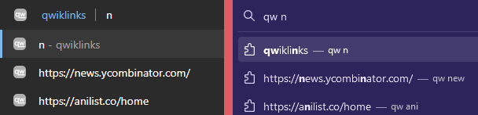
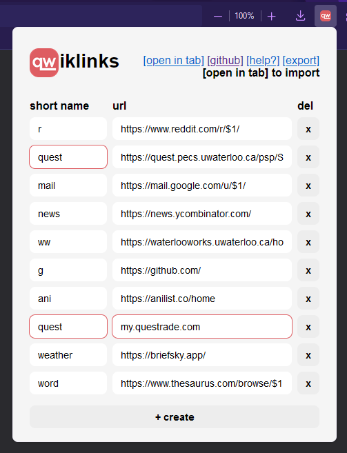

# qwiklinks

Access long URLs with short, easy-to-remember names.

## Why

**qwiklinks** was built as a way to help people get around in their browser faster. Instead of having to memorize URL prefixes or randomly typing in keywords until the search bar autocompletes the URL, you can simply associate the URL with a short and memorable name. In a sense, qwiklinks are similar to bookmarks, but don't require you to use your mouse, take up no screen space, and thus scale "infinitely" (i.e. you don't have to sift through the bookmarks dropdown to find the one you're looking for).

If you've used [GoLinks](https://www.golinks.io/), you can think of it as a "personal" alternative to their product. For a more in-depth explanation of the benefits over using bookmarks, see their website and [blog post](https://www.golinks.com/blog/how-to-save-links-the-better-alternative-to-bookmarks/) for resources written by those much more proficient in the ways of persuasion than I.

## Usage

You can use qwiklinks either through an extension on your browser, or as a background service on your local machine.

## Extension

The qwiklinks extension allows you to access your links through the browser search bar (for developers, see [omnibox](https://developer.mozilla.org/en-US/docs/Mozilla/Add-ons/WebExtensions/API/omnibox)). Simply type `qw <name>` and hit enter to load the corresponding URL. A list of suggestions matching what you currently have typed will appear as you type the name.

You can specify arguments by inserting placeholders in the form of `$D` in your URL, where `D` is some number between 1 and 9 inclusive. You can then specify arguments by inserting a space after your qwiklink name. For example, to navigate to the "/r/all" subreddit in the below image, one would type `qw r all` into the searchbar. All instances of `$1` in the URL will be replaced by `all`.

The qwiklinks extension provides a dashboard to manage your links. This dashboard is accessible by clicking the qwiklinks extension through the toolbar or through the options page (Extensions > Manage Extensions > Ellipsis on qwiklinks > Options). You can also open it in its own tab by opening the popup and pressing `[open in tab]`.

#### Import/Export

You can export your links to a file, which can then be shared across browsers or with other users through the import options. On Firefox, the import options will only appear when the dashboard is open in its own tab (due to some limitations of popups for security reasons).

There are two types of import options:

- `[append]` will add all of the new links on top of your existing ones, so you won't lose anything.
- `[replace]` is a **destructive** action. It will override all of your existing links and replace them with the new ones. Take care when using this option (TODO prompt?)

### Installation

- [Firefox](https://addons.mozilla.org/en-CA/firefox/addon/qwiklinks/)

### Roadmap

- [x] Arguments ($1, $2, ...)
  - [ ] Default arguments
- [x] Autosuggest
- [x] Export and import (append/replace)
- [ ] Themes
- [ ] Make help? less sketchy
- [ ] An actual homepage, so users don't have to read this mess I just wrote up
- [ ] Switch scripts to deno/node?

## Service

> For now, use of the service is not recommended. It is missing a few features and is a hassle to set up relative to the browser extensions.

Enables browser-agnostic link redirection through the `qw/` prefix.

### Setup

- Ensure localhost port 80 is free.
- Add `127.0.0.1 qw` to your hosts file.
- Install [deno](https://deno.land/).
- Generate the binary by running `deno compile --allow-read --allow-net --output qwiklinks service/main.ts`.
- Execute the compiled binary with elevated permissions (e.g. `sudo /path/to/qwiklinks`)

### Roadmap

- [ ] Arguments ($1, $2, ...)
- [ ] Web dashboard to manage links
- [ ] Export and import links
- [x] Hot reload links.toml

## Development

Development is done Firefox-first, with the Chromium code being generated using `scripts/pkg-chromium.sh`. The codebases for the two extensions are practically identical, with a few differences.

- The Firefox extension uses Manifest V2, while the Chromium one uses V3
- The browser APIs for Firefox use the `browser` namespace, while Chromium uses `chrome`. `chrome` should also work in Firefox, but just to be safe, I will stick with `browser`

### Scripts

All scripts live in the `scripts/` directory. It is recommended to run `chmod +x scripts/*.sh` prior to running any scripts.

- `copy-icons` copies the icons from the `assets/` folder to the unpacked extension directories.
- `pkg-${browser}` builds the packed extension for the specified browser.
- `pkg-all` does the same as above but for all supported browsers
